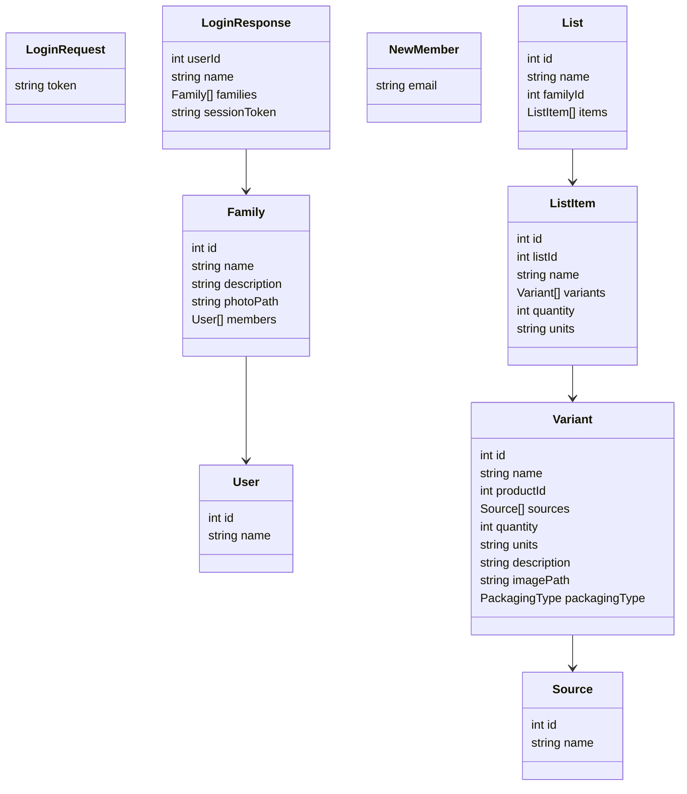

# API Definition

Forager's API will try to be as fast as possible, which means as few actual requests to the database as possible. We will therefore not follow true RESTful API design principles, but instead pack every response with as much data as possible.

In addition, we must make the app function as well as possible offline, especially for viewing and maintaining lists. We will therefore create a Service Worker to act as a caching proxy. With every API response that passes through it, the Service Worker will store all the data in the response in its own internal database. In offline mode, the API requests will be serviced from this database.

## Definition

The API for Forager will be defined with the following methods:

| Verb               | method           | path                 | request object | response object |
| ------------------ | ---------------- | -------------------- | -------------- | --------------- |
| POST               | login            | /login               | LoginRequest   | LoginResponse   |
| **Families**       |
| PUT                | create family    | /family              | Family         | Family          |
| GET                | get family       | /family/_id_         | -              | Family          |
| POST               | update family    | /family/_id_         | Family         | Family          |
| POST               | add member       | /family/_id_/add     | NewMember      | Family          |
| Delete             | delete family    | /family/_id_         | -              | -               |
| **Shopping Lists** |
| PUT                | create list      | /list                | List           | List            |
| GET                | get list         | /list/_id_           | -              | List            |
| POST               | update list [^1] | /list/_id_           | List           | List            |
| Delete             | delete list      | /list/_id_           | -              | -               |
| PUT                | create item      | /list/_id_/item      | ListItem       | ListItem        |
| GET                | get item         | /list/_id_/item/_id_ | -              | ListItem        |
| POST               | update item      | /list/_id_/item/_id_ | ListItem       | ListItem        |
| Delete             | delete item      | /list/_id_/item/_id_ | -              | -               |
| **Sources**        |
| PUT                | create source    | /source              | Source         | Source          |
| GET                | get source       | /source/_id_         | -              | Source          |
| POST               | update source    | /source/_id_         | Source         | Source          |
| Delete             | delete source    | /source/_id_         | -              | -               |

[^1]: This call accepts a full list of items, which will completely replace any existing items. It can also be used to clear the list. If no items property is provided, no change is applied.

