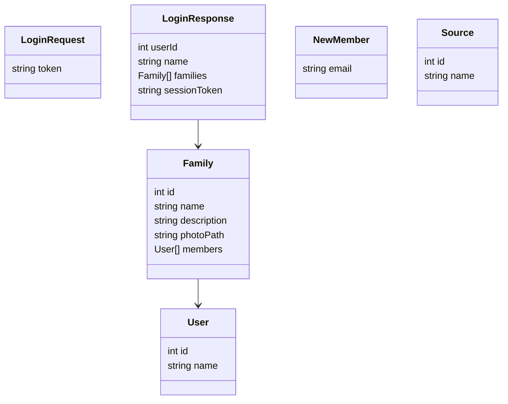

# API Definition

The API for Forager will be defined with the following methods:

| Verb               | method        | path             | request object | response object |
| ------------------ | ------------- | ---------------- | -------------- | --------------- |
| POST               | login         | /login           | LoginRequest   | LoginResponse   |
| **Families**       |
| PUT                | create family | /family          | Family         | Family          |
| GET                | get family    | /family/_id_     | -              | Family          |
| POST               | update family | /family/_id_     | Family         | Family          |
| POST               | add member    | /family/_id_/add | NewMember      | Family          |
| Delete             | delete family | /family/_id_     | -              | -               |
| **Shopping Lists** |
| PUT                | create list   | /list            | List           | List            |
| GET                | get list      | /list/_id_       | -              | List            |
| POST               | update list   | /list/_id_       | List           | List            |
| Delete             | delete list   | /list/_id_       | -              | -               |
| **Sources**        |
| PUT                | create source | /source          | Source         | Source          |
| GET                | get source    | /source/_id_     | -              | Source          |
| POST               | update source | /source/_id_     | Source         | Source          |
| Delete             | delete source | /source/_id_     | -              | -               |

