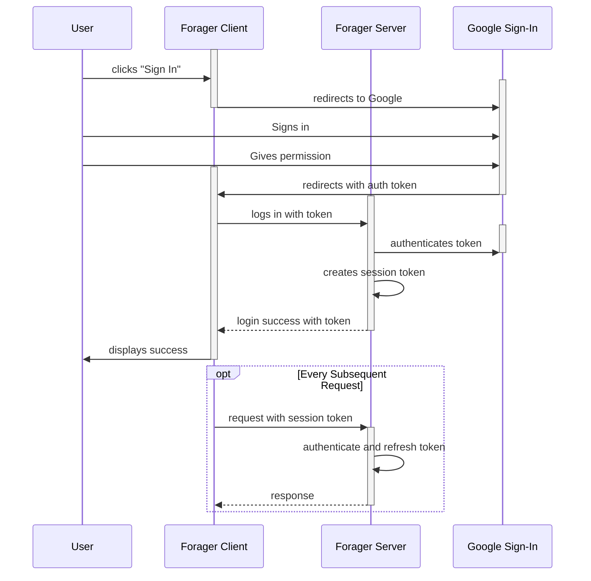

# Authentication Model

Forager will use [Google Sign-in](https://developers.google.com/identity/sign-in/web/sign-in) for user authentication. All the known users of the platform have Google accounts, so for the initial development, this seems most efficient.

The flow goes something like this:

- User clicks "Sign In", whether they are a new or existing user.
- Forager sends them to Google Sign In.
- User authenticates with Google.
- User gives permission for Forager to use their details (new users only - Google will remember).
- Google Sign In redirects back to Forager with a token.
- Forager client sends login request to server with token.
- Server authenticates the token with Google Sign In.
- Find user in our database based on email address from Google.
  - If no user is found, adds user.
- Creates session token, stores it in a session bag with a 20 minute expiry, returns a successful login response, including the token.
- All future requests include the token
  - Each check restarts the 20 minute expiry

