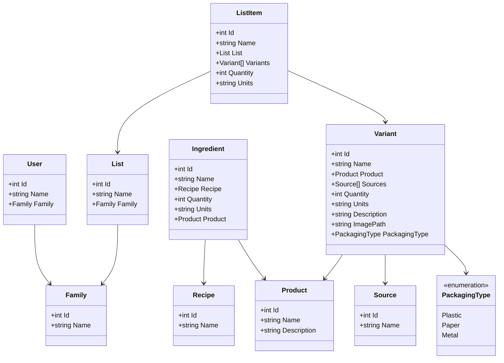

# Data Model

This document will describe the data model, which is intended to be used in Entity Framework. This will define the database structure, and the interface between the application (API) and the data.

