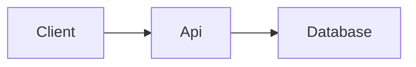

# Forager High Level Design

This document will outline the high level arrangement of components in the system.

## Tech Stack

The following technologies will be used in each of the three components:

| Component | Stack                          |
| --------- | ------------------------------ |
| Database  | ???                            |
| API       | .Net Core 3, ASP Core Web APIs |
| Client    | React, Ionic                   |
| Hosting   | Azure Cloud                    |
